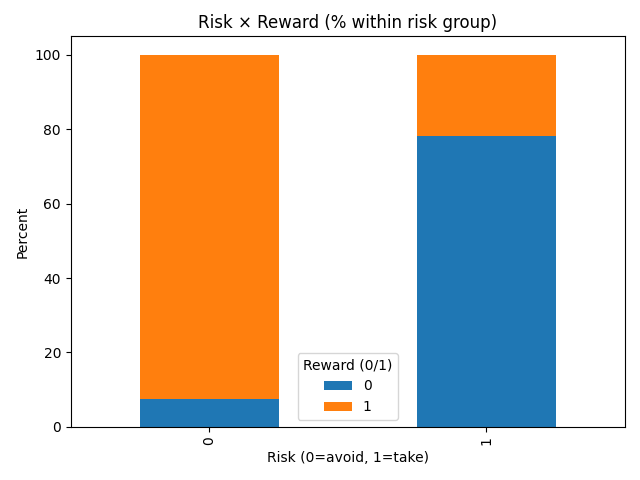

# Predator–Prey Dataset Study

This repository contains a postgraduate academic project exploring predator–prey interactions using ecological data. The analysis focuses on data inspection, cleaning, and inferential statistical methods with Python.

---

## Environment Setup

The project was developed in a **conda environment** using [Miniconda](https://docs.conda.io/en/latest/miniconda.html).  

1. **Install Miniconda** (if not already installed):  
   [Download Miniconda](https://docs.conda.io/en/latest/miniconda.html) for your OS.

2. **Create a new environment** (e.g., named `study`):  
   ```bash
   conda create -n study python=3.10
   ```

3. **Activate the environment**
    ```bash
   conda activate study
   ```

4. **Install dependencies**
    ```bash
   conda install pandas matplotlib scipy statsmodels
   ```


## Project Workflow

- **Data Inspection**: initial checks of structure, missing values, and summary statistics.  
- **Data Cleaning**: handling missing data, converting datatypes, and preparing cleaned datasets.  
- **Inferential Analysis**: statistical tests and visualisations to explore predator–prey interactions.  


## Example Result

One of the inferential visualisations shows the relationship between **risk-taking and reward outcomes**:



This plot highlights how avoidance and risk-taking behaviours are linked to outcomes in the dataset.

---

## Notes

- This project was completed as part of a **postgraduate academic study**.  
- The repository demonstrates a workflow of **data inspection, cleaning, and inferential analysis** using Python.  
- Only selected results are shown here for illustration; full dataset details are not included.  
